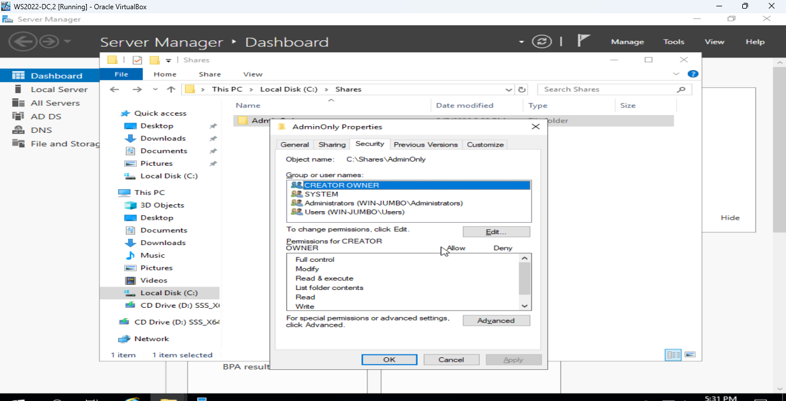
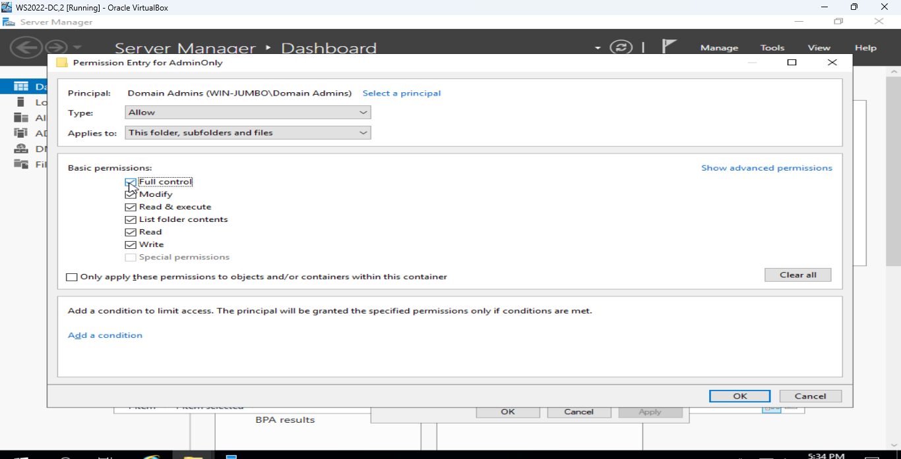
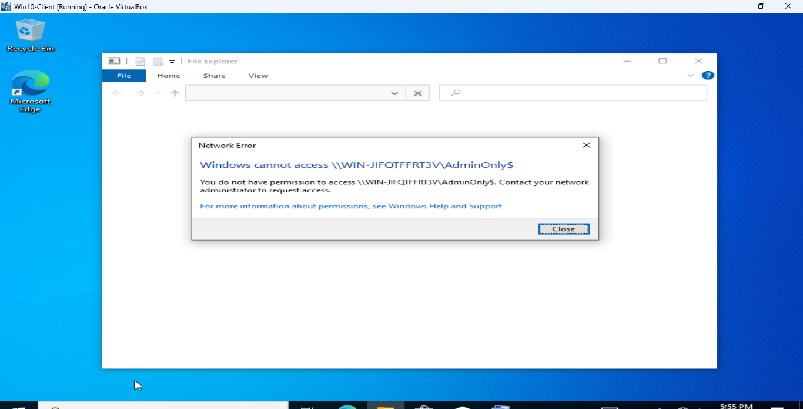

# Active Directory Lab: Restricted Folder Access

## Project Overview
This lab focuses on the principle of **Least Privilege**. I configured a Windows Server environment to ensure that sensitive data is only accessible by authorized Domain Administrators, preventing unauthorized access from standard user accounts.

## Environments & Tools
* **Windows Server 2022** (Domain Controller)
* **Windows 10/11** (Target Client Machine)
* **Active Directory Users and Computers (ADUC)**

## Step-by-Step Implementation

### 1. Creating the Security Group
I created a specific Security Group to manage who has access to the restricted folder.

### 2. Configuring NTFS Permissions
To secure the folder, I had to break the permission inheritance from the parent drive.
* **Action:** Right-click Folder > Properties > Security > Advanced.
* **Key Step:** Clicked "Disable Inheritance" to remove default 'Authenticated Users' permissions.

### 3. Assigning Explicit Access
I added the Admin group and granted them **Full Control**, while ensuring no other non-admin users remained in the list.

## Verification & Testing
### Scenario 1: Standard User Access
When logged in as a standard employee, attempting to open the folder results in:
**Result:** "You don’t currently have permission to access this folder."

### Scenario 2: Administrator Access
When logged in as a Domain Admin, the folder opens successfully, allowing file creation and deletion.
**Result:** Success.
---
## Key Concepts Learned
During this lab, I deepened my understanding of several core Identity and Access Management (IAM) principles:

* **Inheritance:** Understanding how permissions flow from a parent folder to sub-folders and how to strategically break that flow to secure sensitive data.
* **Explicit Permissions:** Learning to set specific "Allow" or "Deny" rules that override inherited settings.
* **Security Identifiers (SIDs):** Observing how Windows tracks users and groups internally through unique alphanumeric strings.
* **Least Privilege:** Implementing the security best practice of giving users only the access they absolutely need to perform their jobs.
